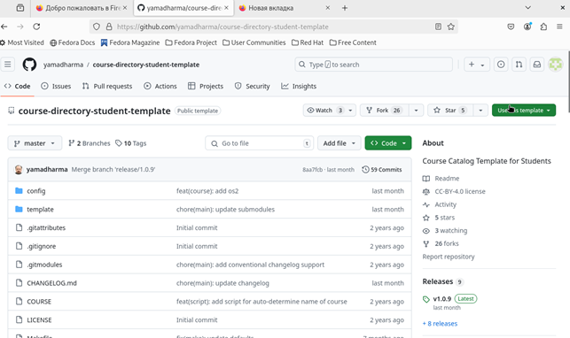

---
## Front matter
title: "Отчёт по лабораторной работе 2"
subtitle: "Система контроля версий Git"
author: "Зиборова Вероника Николаевна НММбд-02-24"

## Generic otions
lang: ru-RU
toc-title: "Содержание"

## Bibliography
bibliography: bib/cite.bib
csl: pandoc/csl/gost-r-7-0-5-2008-numeric.csl

## Pdf output format
toc: true # Table of contents
toc-depth: 2
lof: true # List of figures
lot: true # List of tables
fontsize: 12pt
linestretch: 1.5
papersize: a4
documentclass: scrreprt
## I18n polyglossia
polyglossia-lang:
  name: russian
  options:
	- spelling=modern
	- babelshorthands=true
polyglossia-otherlangs:
  name: english
## I18n babel
babel-lang: russian
babel-otherlangs: english
## Fonts
mainfont: PT Serif
romanfont: PT Serif
sansfont: PT Sans
monofont: PT Mono
mainfontoptions: Ligatures=TeX
romanfontoptions: Ligatures=TeX
sansfontoptions: Ligatures=TeX,Scale=MatchLowercase
monofontoptions: Scale=MatchLowercase,Scale=0.9
## Biblatex
biblatex: true
biblio-style: "gost-numeric"
biblatexoptions:
  - parentracker=true
  - backend=biber
  - hyperref=auto
  - language=auto
  - autolang=other*
  - citestyle=gost-numeric
## Pandoc-crossref LaTeX customization
figureTitle: "Рис."
tableTitle: "Таблица"
listingTitle: "Листинг"
lofTitle: "Список иллюстраций"
lotTitle: "Список таблиц"
lolTitle: "Листинги"
## Misc options
indent: true
header-includes:
  - \usepackage{indentfirst}
  - \usepackage{float} # keep figures where there are in the text
  - \floatplacement{figure}{H} # keep figures where there are in the text
---

# Цель работы

Целью работы является изучить идеологию и применение средств контроля версий. Приобрести практические навыки по работе с системой git.

# Выполнение лабораторной работы

Регистрируюсь на гитхабе.
Нахожу шаблонный репозиторий и создаю из него свой.

{ #fig:001 width=70%, height=70% }

Сначала сделаем предварительную конфигурацию git, создаю пользователя и ставлю параметры.

{ #fig:002 width=70%, height=70% }

Далее создаю ключи для идентификации.

{ #fig:003 width=70%, height=70% }

И добавляю ключ в профиль на гитхабе

{ #fig:004 width=70%, height=70% }

Теперь я создаю рабочий каталог и клонирую туда репозиторий с гитхаба.

{ #fig:005 width=70%, height=70% }

Создаю курс и структуру папок

{ #fig:006 width=70%, height=70% }

Отправляю в гитхаб

{ #fig:007 width=70%, height=70% }

{ #fig:008 width=70%, height=70% }

Загружаю отчеты по работам на гитхаб. 

{ #fig:009 width=70%, height=70% }

{ #fig:010 width=70%, height=70% }

# Выводы

В ходе выполнения работы изучили работу с GitHub.

# Вопросы для самопроверки

1.	Что такое системы контроля версий (VCS) и для решения каких задач они предназначаются?

Системы контроля версий (VCS — Version Control Systems) — это инструменты, позволяющие отслеживать изменения в файлах, управлять версиями проектов, восстанавливать предыдущие состояния и координировать совместную работу над проектом. Основные задачи VCS:
- Хранение истории изменений
- Восстановление прошлых версий
- Совместная работа нескольких разработчиков
- Ветвление и слияние версий проекта
- Снижение рисков потери данных

2.	Объясните следующие понятия VCS и их отношения: хранилище, commit, история, рабочая копия.

Хранилище (репозиторий) — место, где хранятся все версии файлов проекта, включая их историю изменений. Это может быть локальный каталог на компьютере или удалённый сервер.

Commit — фиксация изменений в проекте. Каждый commit сохраняет текущие изменения и добавляет их в историю проекта.

История — последовательность commit'ов, представляющая эволюцию проекта. Она позволяет вернуться к любой версии проекта в прошлом.

Рабочая копия — локальная версия файлов проекта, с которой работает разработчик. Она может быть изменена до создания commit'а.

3. Что представляют собой и чем отличаются централизованные и децентрализованные VCS? Приведите примеры VCS каждого вида.

Централизованные VCS (CVCS) хранят все данные на одном сервере, к которому обращаются все разработчики. Примеры: SVN, CVS. Основной недостаток — зависимость от центрального сервера.

Децентрализованные VCS (DVCS) хранят полную копию репозитория у каждого разработчика, и обмен изменениями происходит напрямую между локальными копиями. Примеры: Git, Mercurial. Основное преимущество — отсутствие зависимости от центрального сервера и возможность работать автономно.

4. Опишите действия с VCS при единоличной работе с хранилищем.

* Инициализация репозитория (например, git init).

* Добавление файлов под контроль версий (git add).

* Фиксация изменений с созданием commit'ов (git commit).

* Работа с ветками (опционально).

* Просмотр истории изменений (git log).

* Откат к предыдущей версии (при необходимости, например, с помощью git checkout или git revert).

5. Опишите порядок работы с общим хранилищем VCS.

* Клонирование общего репозитория (git clone).
* Создание новой ветки для своей задачи (git checkout -b new-feature).

* Внесение изменений и создание commit'ов.

* Синхронизация с удалённым репозиторием (git pull для получения новых изменений).

* Отправка изменений в удалённый репозиторий (git push).

* Создание pull request'а для объединения изменений в основную ветку.

6.	Каковы основные задачи, решаемые инструментальным средством git?

* Отслеживание изменений файлов

* Создание и управление ветками

* Совместная работа над проектом через pull requests и push/pull операций

* Разрешение конфликтов при слиянии изменений

* Поддержка распределённой модели работы с репозиториями

* Восстановление предыдущих версий проекта

7.	Назовите и дайте краткую характеристику командам git.

* git init — создание нового репозитория

* git clone — клонирование удалённого репозитория

* git add — добавление изменений в область подготовки

* git commit — создание commit'а

* git status — проверка состояния репозитория

* git log — просмотр истории commit'ов

* git pull — получение изменений из удалённого репозитория

* git push — отправка изменений в удалённый репозиторий

8. Приведите примеры использования при работе с локальным и удалённым репозиториями.

**Локальный репозиторий:**

* Создание репозитория: git init

* Добавление файла: git add file.txt

* Фиксация изменений: git commit -m "Add file"

**Удалённый репозиторий:**

* Клонирование: git clone https://example.com/repo.git

* Получение изменений: git pull origin main

* Отправка изменений: git push origin main
