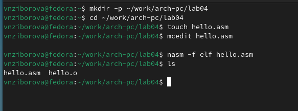
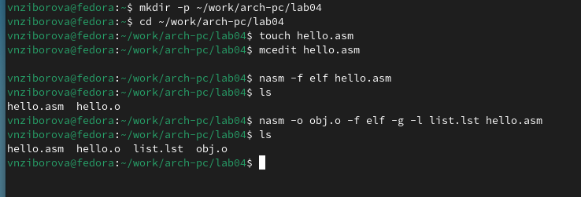
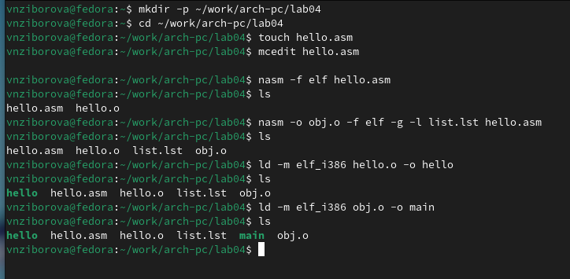
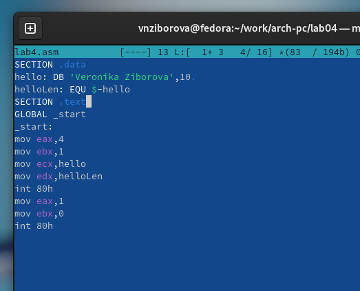
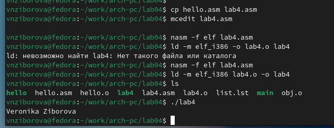

---
## Front matter
title: "Отчёт по лабораторной работе 4"
subtitle: "Создание и процесс обработки программ на языке ассемблера NASM"
author: "Зиборова Вероника Николаевна НММбд-02-24"

## Generic otions
lang: ru-RU
toc-title: "Содержание"

## Bibliography
bibliography: bib/cite.bib
csl: pandoc/csl/gost-r-7-0-5-2008-numeric.csl

## Pdf output format
toc: true # Table of contents
toc-depth: 2
lof: true # List of figures
lot: true # List of tables
fontsize: 12pt
linestretch: 1.5
papersize: a4
documentclass: scrreprt
## I18n polyglossia
polyglossia-lang:
  name: russian
  options:
	- spelling=modern
	- babelshorthands=true
polyglossia-otherlangs:
  name: english
## I18n babel
babel-lang: russian
babel-otherlangs: english
## Fonts
mainfont: PT Serif
romanfont: PT Serif
sansfont: PT Sans
monofont: PT Mono
mainfontoptions: Ligatures=TeX
romanfontoptions: Ligatures=TeX
sansfontoptions: Ligatures=TeX,Scale=MatchLowercase
monofontoptions: Scale=MatchLowercase,Scale=0.9
## Biblatex
biblatex: true
biblio-style: "gost-numeric"
biblatexoptions:
  - parentracker=true
  - backend=biber
  - hyperref=auto
  - language=auto
  - autolang=other*
  - citestyle=gost-numeric
## Pandoc-crossref LaTeX customization
figureTitle: "Рис."
tableTitle: "Таблица"
listingTitle: "Листинг"
lofTitle: "Список иллюстраций"
lotTitle: "Список таблиц"
lolTitle: "Листинги"
## Misc options
indent: true
header-includes:
  - \usepackage{indentfirst}
  - \usepackage{float} # keep figures where there are in the text
  - \floatplacement{figure}{H} # keep figures where there are in the text
---

# Цель работы

Целью работы является освоение процедуры компиляции и сборки программ, написанных на ассемблере NASM.

# Выполнение лабораторной работы

## Программа Hello world!

Создала каталог lab04 командой mkdir, перешла в него с помощью команды cd 
и создала файл hello.asm, в который напишу программу.
Убеждаюсь с помощью команды ls, что создал файл.

{ #fig:001 width=70%, height=70% }

Написала программу по заданию на языке ассемблера.

{ #fig:002 width=70%, height=70% }

## Транслятор NASM

NASM превращает текст программы в объектный код. Если текст программы набран без ошибок, то транслятор преобразует текст программы из файла hello.asm в объектный код, который запишется в файл hello.o. 

Транслировала файл командой nasm. Получился объектный файл hello.o.

{ #fig:003 width=70%, height=70% }

## Расширенный синтаксис командной строки NASM

Полный вариант командной строки nasm выглядит следующим образом: 

```bash

nasm [-@ косвенный_файл_настроек] [-o объектный_файл] [-f формат_объектного_файла] [-l листинг] [параметры...] [--] исходный_файл

```

Транслировала файл командой nasm с дополнительными опциями. 
С опцией -l Получил файл листинга list.lst, с опцией -f объектный файл obj.o, с опцией -g в программу добавилась отладочная информация.

{ #fig:004 width=70%, height=70% }

## Компоновщик LD

Чтобы получить исполняемую программу, объектный файл необходимо передать на обработку компоновщику.

Выполнила команду ld и получила исполняемый файл hello из объектного файла hello.o.

{ #fig:005 width=70%, height=70% }

Еще раз выполнила команду ld для объектного файла obj.o и получила исполняемый файл main.

{ #fig:006 width=70%, height=70% }

## Запуск исполняемого файла

Запустила исполняемые файлы.

{ #fig:007 width=70%, height=70% }

## Задание для самостоятельной работы

Скопировала файл hello.asm в файл lab4.asm.

{ #fig:008 width=70%, height=70% }

Изменила сообщение Hello world на свое имя.

{ #fig:009 width=70%, height=70% }

Запустила программу и проверила.

{ #fig:010 width=70%, height=70% }

# Выводы

Освоили процесс компиляции и сборки программ, написанных на ассемблере nasm.

# Вопросы для самопроверки

1. Какие основные отличия ассемблерных программ от программ на языках высокого
уровня?

**Уровень абстракции**: Ассемблерные программы работают напрямую с машинными инструкциями, что требует от программиста понимания архитектуры процессора, адресации памяти и регистров. Программы на языках высокого уровня (например, C++, Python) предоставляют более абстрактные конструкции (циклы, функции, классы), скрывающие детали работы процессора.

**Число инструкций**: Ассемблерные программы требуют написания большего количества инструкций для выполнения простых задач, в то время как в языках высокого уровня многие операции выполняются одной строчкой кода.

**Портируемость**: Ассемблерный код сильно зависит от архитектуры конкретного процессора (например, x86, ARM), в то время как программы на языках высокого уровня могут быть легче перенесены на другую платформу при наличии соответствующего компилятора.

**Оптимизация**: Ассемблерные программы могут быть сильно оптимизированы для работы с конкретным оборудованием, что делает их более эффективными по производительности. Языки высокого уровня полагаются на компиляторы, которые автоматически производят оптимизацию, но не всегда с таким уровнем эффективности.

2. В чём состоит отличие инструкции от директивы на языке ассемблера?

**Инструкция** — это команда, которая будет непосредственно преобразована в машинный код и выполнена процессором. Например, инструкции для работы с регистрами, памятью, или выполнения арифметических операций.

**Директива** — это команда для ассемблера, которая не превращается в машинный код, а управляет процессом компиляции или настройкой программы. Например, директивы указывают, как организовать память, где начинается программа, или как подключить внешние библиотеки (например, section, global).

3. Перечислите основные правила оформления программ на языке ассемблера.

**Чёткая структура кода**: Обычно программа состоит из секций (например, .text, .data), где каждая секция отвечает за разные типы данных (инструкции, данные, стек).

**Комментарии**: Программы на ассемблере обычно сложны для понимания, поэтому комментарии играют важную роль в объяснении назначения каждой строки кода.

**Использование регистров и памяти**: Необходимо чётко управлять регистрами и адресами памяти, чтобы избежать ошибок (например, выход за границы памяти или ошибки при работе с регистрами).

**Именование меток и переменных**: Метки должны быть уникальными и легко читаемыми, чтобы можно было быстро понять структуру программы и её логику.

4. Каковы этапы получения исполняемого файла?

**Написание исходного кода** на языке программирования.

**Трансляция (ассемблирование)**: Ассемблер преобразует исходный код в машинный код (объектный файл).

**Компоновка (линковка)**: Компоновщик объединяет объектные файлы и подключаемые библиотеки в исполняемый файл.

**Загрузка и выполнение**: Исполняемый файл загружается в память и выполняется операционной системой.

5. Каково назначение этапа трансляции?

Трансляция — это процесс, при котором исходный код программы на языке ассемблера переводится в машинный код (объектный файл). На этом этапе проверяется синтаксис программы, распределяются регистры, память и создаются машинные инструкции.

6. Каково назначение этапа компоновки?

Компоновка (линковка) — это процесс объединения нескольких объектных файлов и библиотек в единый исполняемый файл. Компоновщик проверяет наличие всех внешних ссылок и функций, а также распределяет адресное пространство для программы.

7. Какие файлы могут создаваться при трансляции программы, какие из них создаются
по умолчанию?

**Объектные файлы** (.o или .obj): Это промежуточные файлы, созданные ассемблером на основе исходного кода. Они содержат машинные инструкции и ссылки на внешние библиотеки.

**Исполняемые файлы** (.exe, .out): Финальные файлы, которые создаются после компоновки и могут быть выполнены операционной системой.

**Отладочные файлы** (.debug): Создаются по желанию для целей отладки программы.

8. Каковы форматы файлов для nasm и ld?

NASM (Netwide Assembler): Использует объектные форматы, такие как ELF (для Linux), COFF (для Windows), Mach-O (для macOS), а также плоский бинарный формат (.bin).

LD (GNU Linker): Поддерживает различные форматы объектных файлов и исполняемых файлов, такие как ELF и PE (для Windows).