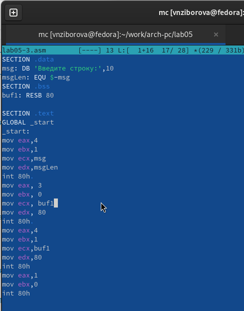

---
## Front matter
title: "Отчёт по лабораторной работе 5"
subtitle: "Основы работы с Midnight Commander. Структура программы на языке ассемблера NASM. Системные вызовы в ОС GNU Linux"
author: "Зиборова Вероника Николаевна НММбд-02-24"

## Generic otions
lang: ru-RU
toc-title: "Содержание"

## Bibliography
bibliography: bib/cite.bib
csl: pandoc/csl/gost-r-7-0-5-2008-numeric.csl

## Pdf output format
toc: true # Table of contents
toc-depth: 2
lof: true # List of figures
lot: true # List of tables
fontsize: 12pt
linestretch: 1.5
papersize: a4
documentclass: scrreprt
## I18n polyglossia
polyglossia-lang:
  name: russian
  options:
	- spelling=modern
	- babelshorthands=true
polyglossia-otherlangs:
  name: english
## I18n babel
babel-lang: russian
babel-otherlangs: english
## Fonts
mainfont: PT Serif
romanfont: PT Serif
sansfont: PT Sans
monofont: PT Mono
mainfontoptions: Ligatures=TeX
romanfontoptions: Ligatures=TeX
sansfontoptions: Ligatures=TeX,Scale=MatchLowercase
monofontoptions: Scale=MatchLowercase,Scale=0.9
## Biblatex
biblatex: true
biblio-style: "gost-numeric"
biblatexoptions:
  - parentracker=true
  - backend=biber
  - hyperref=auto
  - language=auto
  - autolang=other*
  - citestyle=gost-numeric
## Pandoc-crossref LaTeX customization
figureTitle: "Рис."
tableTitle: "Таблица"
listingTitle: "Листинг"
lofTitle: "Список иллюстраций"
lotTitle: "Список таблиц"
lolTitle: "Листинги"
## Misc options
indent: true
header-includes:
  - \usepackage{indentfirst}
  - \usepackage{float} # keep figures where there are in the text
  - \floatplacement{figure}{H} # keep figures where there are in the text
---

# Цель работы

Целью работы является приобретение практических навыков работы в Midnight Commander, а также освоение инструкций языка ассемблера mov и int.

# Выполнение лабораторной работы

## Знакомство с Midnight Commander

Я запустила Midnight Commander и, используя стрелочные клавиши и клавишу Enter, перешла в каталог ~/work/arch-pc. Затем нажала F7 для создания нового каталога lab05.

{ #fig:001 width=70%, height=70% }

{ #fig:002 width=70%, height=70% }

С помощью команды touch я создала файл lab05-1.asm.

{ #fig:003 width=70%, height=70% }

Я открыла файл для редактирования, нажав F4, выбрала редактор mceditor и написала код программы в соответствии с заданием.

{ #fig:004 width=70%, height=70% }

Для проверки я открыла файл на просмотр, нажав F3, и убедилась, что он содержит правильный код.

{ #fig:005 width=70%, height=70% }

Я скомпилировала программу, сгенерировала объектный файл, произвела компоновку и запустила исполняемый файл, чтобы убедиться в корректности работы.

{ #fig:006 width=70%, height=70% }

## Подключение внешнего файла in_out.asm

Я скачала файл in_out.asm и разместила его в рабочем каталоге. Для копирования я использовала клавишу F5, а для перемещения – клавишу F6.

{ #fig:007 width=70%, height=70% }

Я также скопировала файл lab05-1.asm в новый файл lab05-2.asm.

{ #fig:008 width=70%, height=70% }

В файле lab05-2.asm я написала код программы, используя подпрограммы из внешнего файла in_out.asm. Программа была успешно скомпилирована и протестирована.

{ #fig:009 width=70%, height=70% }

{ #fig:010 width=70%, height=70% }

В файле lab05-2.asm я заменила подпрограмму sprintLF на sprint. После пересборки исполняемого файла, теперь вывод строки не завершается символом новой строки.

{ #fig:011 width=70%, height=70% }

{ #fig:012 width=70%, height=70% }

## Задание для самостоятельной работы

Я скопировала программу lab05-1.asm и изменила код так, чтобы он работал по следующему алгоритму:

* вывести приглашение с текстом “Введите строку:”;
* считать строку с клавиатуры;
* вывести введённую строку на экран.

{ #fig:013 width=70%, height=70% }

{ #fig:014 width=70%, height=70% }

{ #fig:015 width=70%, height=70% }

Аналогично, я скопировала программу lab05-2.asm и внесла изменения в код, теперь используя подпрограммы из файла in_out.asm.

{ #fig:016 width=70%, height=70% }

{ #fig:017 width=70%, height=70% }

{ #fig:018 width=70%, height=70% }

# Выводы

Я научилась писать базовые ассемблерные программы и освоила ассемблерные инструкции mov и int.

# Вопросы для самопроверки

1. Каково назначение mc?

- Midnight Commander (mc) — это текстовый файловый менеджер, который позволяет пользователям управлять файлами и каталогами в командной строке. Он предоставляет удобный интерфейс для выполнения операций с файлами, таких как копирование, перемещение, удаление и просмотр.

2. Какие операции с файлами можно выполнить как с помощью команд bash, так и с помощью меню (комбинаций клавиш) mc? Приведите несколько примеров.

- В mc можно выполнять операции с файлами как с помощью команд bash, так и с помощью меню. Примеры:
     - **Копирование файла:**
       - Команда bash: cp файл1.txt файл2.txt
       - В mc: выделить файл файл1.txt, нажать F5 и указать имя файл2.txt.
     - **Перемещение файла:**
       - Команда bash: mv файл1.txt папка/
       - В mc: выделить файл файл1.txt, нажать F6 и указать путь папка/.
     - **Удаление файла:**
       - Команда bash: rm файл1.txt
       - В mc: выделить файл файл1.txt, нажать F8.

3. Какова структура программы на языке ассемблера NASM?

- Программа на NASM состоит из трех основных секций:
     - **section .data** — секция для инициализации данных.
     - **section .bss** — секция для объявления неинициализированных данных.
     - **section .text** — секция, содержащая исполняемый код программы.

4. Для описания каких данных используются секции bss и data в языке ассемблера NASM?

  - **Секция .data** используется для хранения инициализированных данных, которые имеют фиксированные значения.
  - **Секция .bss** используется для объявления неинициализированных данных, которые будут выделены в памяти, но не содержат начальных значений.

5. Для чего используются компоненты db, dw, dd, dq и dt языка ассемблера NASM?

- Эти директивы используются для определения переменных различных типов:
     - **db** (define byte) — определяет байт.
     - **dw** (define word) — определяет слово (2 байта).
     - **dd** (define double word) — определяет двойное слово (4 байта).
     - **dq** (define quad word) — определяет квадратичное слово (8 байт).
     - **dt** (define ten bytes) — определяет десятибайтовое значение.

6. Какое произойдёт действие при выполнении инструкции mov eax, esi?

   - Инструкция mov eax, esi копирует значение из регистра esi в регистр eax. Это означает, что после выполнения этой инструкции регистр eax будет содержать то же значение, что и esi.

7. Для чего используется инструкция int 80h?

   - Инструкция int 80h используется для вызова системных функций в Linux. Она передает управление ядру операционной системы для выполнения системного вызова, например, для работы с файлами, сетевыми операциями и управления процессами.
