---
## Front matter
title: "Отчёт по лабораторной работе 8"
subtitle: "Программирование цикла. Обработка аргументов командной строки."
author: "Зиборова Вероника Николаевна НММбд-02-24"

## Generic otions
lang: ru-RU
toc-title: "Содержание"

## Bibliography
bibliography: bib/cite.bib
csl: pandoc/csl/gost-r-7-0-5-2008-numeric.csl

## Pdf output format
toc: true # Table of contents
toc-depth: 2
lof: true # List of figures
lot: true # List of tables
fontsize: 12pt
linestretch: 1.5
papersize: a4
documentclass: scrreprt
## I18n polyglossia
polyglossia-lang:
  name: russian
  options:
	- spelling=modern
	- babelshorthands=true
polyglossia-otherlangs:
  name: english
## I18n babel
babel-lang: russian
babel-otherlangs: english
## Fonts
mainfont: PT Serif
romanfont: PT Serif
sansfont: PT Sans
monofont: PT Mono
mainfontoptions: Ligatures=TeX
romanfontoptions: Ligatures=TeX
sansfontoptions: Ligatures=TeX,Scale=MatchLowercase
monofontoptions: Scale=MatchLowercase,Scale=0.9
## Biblatex
biblatex: true
biblio-style: "gost-numeric"
biblatexoptions:
  - parentracker=trueЗырянов Артём Алексеевич	НБИбд-01-22

  - backend=biber
  - hyperref=auto
  - language=auto
  - autolang=other*
  - citestyle=gost-numeric
## Pandoc-crossref LaTeX customization
figureTitle: "Рис."
tableTitle: "Таблица"
listingTitle: "Листинг"
lofTitle: "Список иллюстраций"
lotTitle: "Список таблиц"
lolTitle: "Листинги"
## Misc options
indent: true
header-includes:
  - \usepackage{indentfirst}
  - \usepackage{float} # keep figures where there are in the text
  - \floatplacement{figure}{H} # keep figures where there are in the text
---

# Цель работы

Целью работы является приобретение навыков написания программ с использованием циклов и обработкой аргументов командной строки..

# Теоретическое введение

Стек — это структура данных, организованная по принципу LIFO («Last In — First Out»
или «последним пришёл — первым ушёл»). Стек является частью архитектуры процессора и
реализован на аппаратном уровне. Для работы со стеком в процессоре есть специальные
регистры (ss, bp, sp) и команды.

Для стека существует две основные операции:

* добавление элемента в вершину стека (push);

* извлечение элемента из вершины стека (pop).

# Выполнение лабораторной работы

## Реализация циклов в NASM

Создала каталог для программ лабораторной работы № 8 и файл lab8-1.asm.

При реализации циклов в NASM с использованием инструкции loop необходимо помнить, что эта инструкция использует регистр ecx в качестве счетчика, уменьшая его значение на единицу с каждым шагом. В качестве примера я рассмотрела программу, которая выводит текущее значение регистра ecx. 

Добавила в файл lab8-1.asm текст программы из листинга 8.1. Затем создала исполняемый файл и проверила его работу.

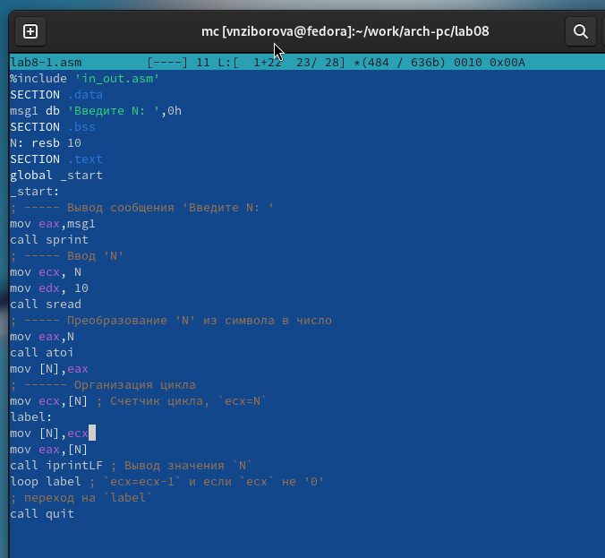{ #fig:001 width=70%, height=70% }

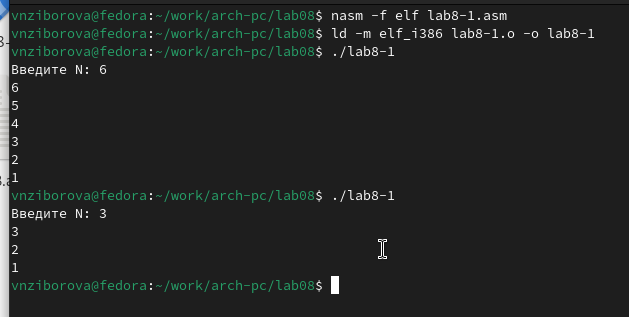{ #fig:002 width=70%, height=70% }

Этот пример показал, что изменение регистра ecx внутри цикла loop может привести к некорректной работе программы. Я изменила текст программы, добавив модификацию регистра ecx в цикле. 

Полученная программа:
- Запускает бесконечный цикл при нечетном значении N.
- Выводит только нечетные числа, если N четное.

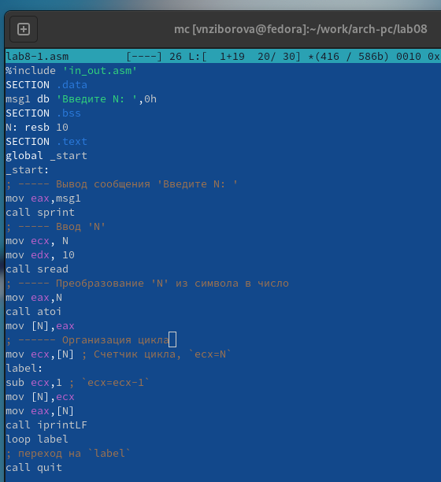{ #fig:003 width=70%, height=70% }

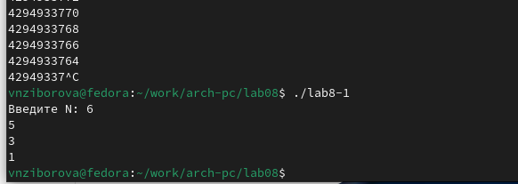{ #fig:004 width=70%, height=70% }

Для корректного использования регистра ecx в цикле, я добавила команды push и pop, чтобы временно сохранять значение регистра в стеке. Это позволило сохранить корректность работы программы. Внесла изменения в текст программы, создала исполняемый файл и проверила его работу. 

Теперь программа:
- Выводит числа от N-1 до 0.
- Число проходов цикла соответствует значению N.

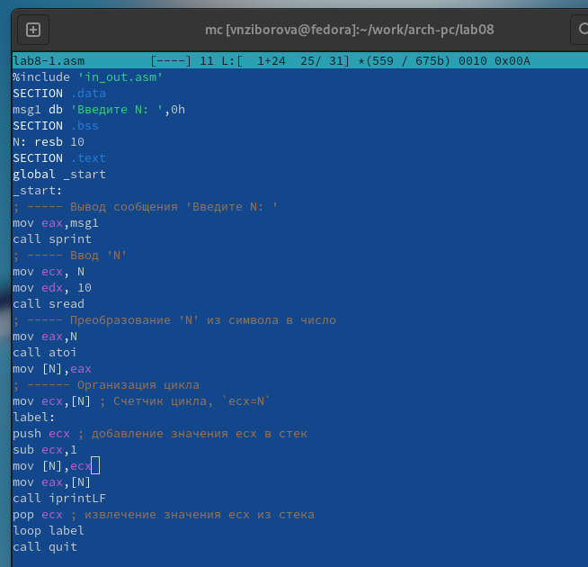{ #fig:005 width=70%, height=70% }

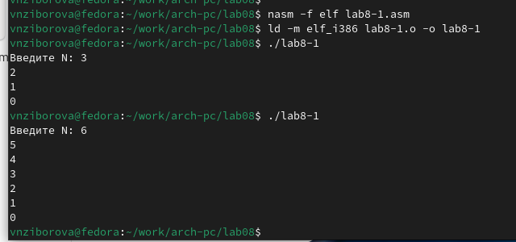{ #fig:006 width=70%, height=70% }

## Обработка аргументов командной строки

Создала файл lab8-2.asm в каталоге ~/work/arch-pc/lab08 и ввела в него текст программы из листинга 8.2.

Создала исполняемый файл и запустила его, указав аргументы. Программа обработала 5 аргументов, разделенных пробелами (слова или числа).

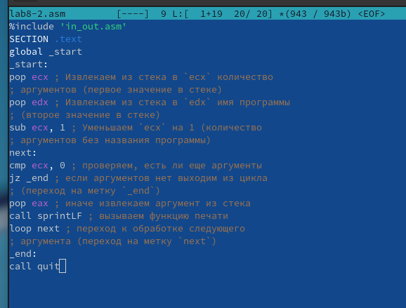{ #fig:007 width=70%, height=70% }

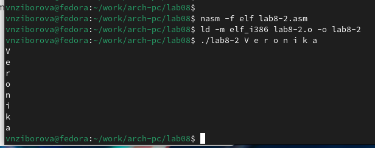{ #fig:008 width=70%, height=70% }

Рассмотрела пример программы, которая выводит сумму чисел, переданных в качестве аргументов командной строки.

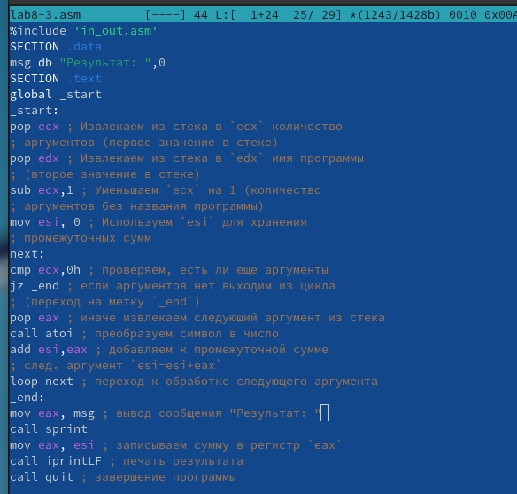{ #fig:009 width=70%, height=70% }

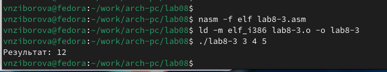{ #fig:010 width=70%, height=70% }

Изменила текст программы из листинга 8.3, чтобы вычислять произведение аргументов.

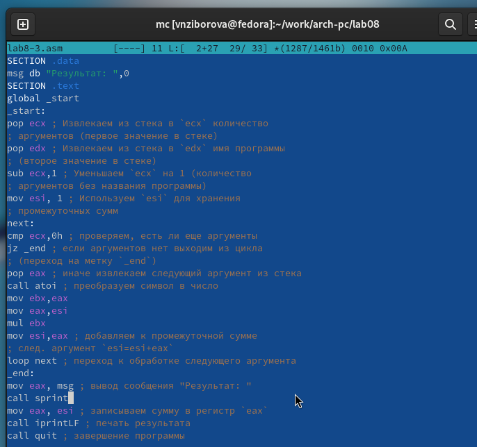{ #fig:011 width=70%, height=70% }

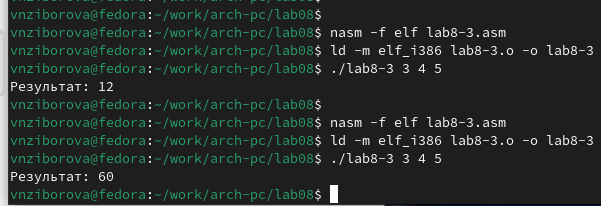{ #fig:012 width=70%, height=70% }

## Задание для самостоятельной работы

Написала программу для нахождения суммы значений функции $f(x)$ для $x = x_1, x_2, ..., x_n$. Программа должна выводить значение $f(x_1) + f(x_2)+ ... + f(x_n)$. 

Значения $x$ передаются в программу как аргументы. 
Для функции $f(x)$ выбрала вариант 6: $f(x) = 4x-3$. 

Создала исполняемый файл и проверила его работу на нескольких наборах значений $x$.

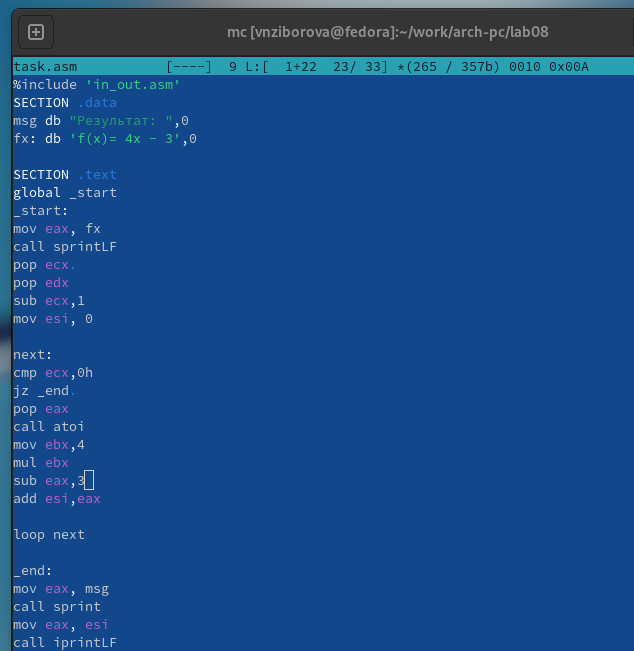{ #fig:013 width=70%, height=70% }

Для проверки запустила программу сначала с одним аргументом:
- При $x=1$, $f(1) = 1$.
- При $x=2$, $f(2) = 5$.

Затем передала несколько аргументов и получила сумму значений функции.

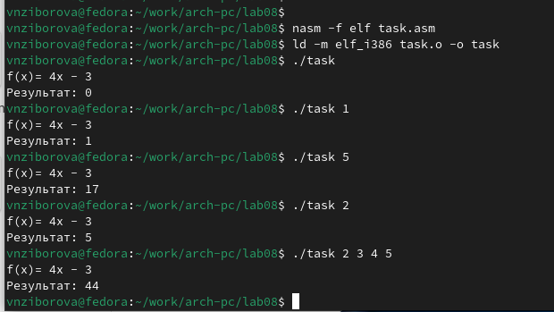{ #fig:014 width=70%, height=70% }

# Выводы

Освоили работы со стеком, циклом и аргументами на ассемблере nasm.

# Ответы на вопросы

1. **Опишите работу команды loop.**
   - Команда loop используется для организации циклов в NASM. Она уменьшает значение регистра ECX (или CX для 16-битных программ) на 1 и проверяет, не стало ли оно равным нулю. Если значение регистра не равно нулю, осуществляется переход по указанной метке. Если равно — выполнение программы продолжается с текущей позиции.

2. **Как организовать цикл с помощью команд условных переходов, не прибегая к специальным командам управления циклами?**
   - Можно использовать прямую арифметическую модификацию регистра и условные переходы. Например:
     1. Инициализировать регистр-счетчик (например, mov ecx, 10).
     2. Внутри цикла уменьшать значение регистра (dec ecx).
     3. Проверять с помощью условной команды (jnz, jz) и организовывать переход на начало цикла.

3. **Дайте определение понятия «стек».**
   - Стек — это структура данных, организованная по принципу «последним пришел — первым вышел» (LIFO, **Last In, First Out**). В контексте NASM стек используется для временного хранения данных, параметров функций, адресов возврата и других данных. Доступ к стеку осуществляется через команды push (помещение данных в стек) и pop (извлечение данных из стека).

4. **Как осуществляется порядок выборки содержащихся в стеке данных?**
   - Данные извлекаются из стека в обратном порядке их помещения. Это соответствует принципу LIFO:
     1. Последний добавленный элемент извлекается первым.
     2. При каждом извлечении указатель стека (регистр ESP для 32-битных программ или SP для 16-битных) увеличивается.
     3. Для доступа к данным используются команды pop (снять элемент) или прямой доступ через указатель стека.
