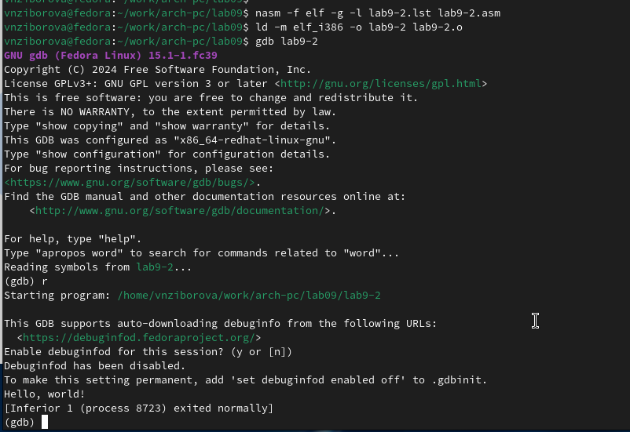

---
## Front matter
title: "Отчёт по лабораторной работе 9"
subtitle: "Понятие подпрограммы. Отладчик GDB."
author: "Зиборова Вероника Николаевна НММбд-02-24"

## Generic otions
lang: ru-RU
toc-title: "Содержание"

## Bibliography
bibliography: bib/cite.bib
csl: pandoc/csl/gost-r-7-0-5-2008-numeric.csl

## Pdf output format
toc: true # Table of contents
toc-depth: 2
lof: true # List of figures
lot: true # List of tables
fontsize: 12pt
linestretch: 1.5
papersize: a4
documentclass: scrreprt
## I18n polyglossia
polyglossia-lang:
  name: russian
  options:
	- spelling=modern
	- babelshorthands=true
polyglossia-otherlangs:
  name: english
## I18n babel
babel-lang: russian
babel-otherlangs: english
## Fonts
mainfont: PT Serif
romanfont: PT Serif
sansfont: PT Sans
monofont: PT Mono
mainfontoptions: Ligatures=TeX
romanfontoptions: Ligatures=TeX
sansfontoptions: Ligatures=TeX,Scale=MatchLowercase
monofontoptions: Scale=MatchLowercase,Scale=0.9
## Biblatex
biblatex: true
biblio-style: "gost-numeric"
biblatexoptions:
  - parentracker=true
  - backend=biber
  - hyperref=auto
  - language=auto
  - autolang=other*
  - citestyle=gost-numeric
## Pandoc-crossref LaTeX customization
figureTitle: "Рис."
tableTitle: "Таблица"
listingTitle: "Листинг"
lofTitle: "Список иллюстраций"
lotTitle: "Список таблиц"
lolTitle: "Листинги"
## Misc options
indent: true
header-includes:
  - \usepackage{indentfirst}
  - \usepackage{float} # keep figures where there are in the text
  - \floatplacement{figure}{H} # keep figures where there are in the text
---

# Цель работы

Целью работы является приобретение навыков написания программ с использованием подпрограмм.
Знакомство с методами отладки при помощи GDB и его основными возможностями.

# Теоретическое введение

Отладка — это процесс поиска и исправления ошибок в программе. 
В общем случае его можно разделить на четыре этапа:

* обнаружение ошибки;

* поиск её местонахождения;

* определение причины ошибки;

* исправление ошибки.

GDB (GNU Debugger — отладчик проекта GNU) работает на многих UNIX-подобных
системах и умеет производить отладку многих языков программирования. 
GDB предлагает обширные средства для слежения и контроля за выполнением 
компьютерных программ. Отладчик не содержит собственного графического 
пользовательского интерфейса и использует стандартный текстовый интерфейс 
консоли. Однако для GDB существует несколько сторонних графических надстроек, 
а кроме того, некоторые интегрированные среды разработки
используют его в качестве базовой подсистемы отладки.
Отладчик GDB (как и любой другой отладчик) позволяет увидеть, что происходит 
«внутри» программы в момент её выполнения или что делает программа в 
момент сбоя.

Подпрограмма — это, как правило, функционально законченный участок кода, 
который можно многократно вызывать из разных мест программы. 
В отличие от простых переходов из подпрограмм существует возврат на команду, следующую за вызовом

# Выполнение лабораторной работы

## Реализация подпрограмм в NASM

Я создала каталог для выполнения лабораторной работы №9 и перешла в него.

В качестве примера рассмотрим программу, которая вычисляет арифметическое выражение \( f(x) = 2x + 7 \) с использованием подпрограммы calcul. В этом примере значение \( x \) вводится с клавиатуры, а само выражение вычисляется в подпрограмме.

{ #fig:001 width=70%, height=70% }

Первые строки программы отвечают за вывод сообщения на экран (с помощью вызова sprint), чтение данных, введенных с клавиатуры (с помощью вызова sread) и преобразование введенных данных из символьного вида в численный (с помощью вызова atoi).

После инструкции call _calcul, которая передает управление подпрограмме _calcul, будут выполнены инструкции, содержащиеся в подпрограмме.

Инструкция ret является последней в подпрограмме и её выполнение приводит к возврату в основную программу к инструкции, следующей за инструкцией call, которая вызвала данную подпрограмму.

Последние строки программы реализуют вывод сообщения (с помощью вызова sprint), вывод результата вычисления (с помощью вызова iprintLF) и завершение программы (с помощью вызова quit).

{ #fig:002 width=70%, height=70% }

Я изменила текст программы, добавив подпрограмму subcalcul в подпрограмму calcul, для вычисления выражения \( f(g(x)) \), где \( x \) вводится с клавиатуры, \( f(x) = 2x + 7, g(x) = 3x - 1 \).

{ #fig:003 width=70%, height=70% }

{ #fig:004 width=70%, height=70% }

## Отладка программ с помощью GDB

Я создала файл lab9-2.asm с текстом программы из Листинга 9.2 (Программа печати сообщения Hello world!).

{ #fig:005 width=70%, height=70% }

После того как я получила исполняемый файл, для работы с GDB в исполняемый файл необходимо добавить отладочную информацию, для чего трансляцию программ следует проводить с ключом -g.

Загрузила исполняемый файл в отладчик GDB и проверила работу программы, запустив её в оболочке GDB с помощью команды run (сокращенно r).

{ #fig:006 width=70%, height=70% }

Для более подробного анализа программы установила брейкпоинт на метку start, с которой начинается выполнение любой ассемблерной программы, и запустила её. Посмотрела дизассемблированный код программы.

{ #fig:007 width=70%, height=70% }

{ #fig:008 width=70%, height=70% }

Для установки точки останова использовала команду break (кратко b). Типичный аргумент этой команды — место установки. Его можно задать либо как номер строки программы (если есть исходный файл и программа компилировалась с отладочной информацией), либо как имя метки, или как адрес. Чтобы избежать путаницы с номерами, перед адресом ставится «звездочка».

На предыдущих шагах была установлена точка останова по имени метки _start. Проверила это с помощью команды info breakpoints (кратко i b).
Затем установила ещё одну точку останова по адресу инструкции. Адрес инструкции можно увидеть в средней части экрана в левом столбце соответствующей инструкции. Определила адрес предпоследней инструкции (mov ebx,0x0) и установила точку.

{ #fig:009 width=70%, height=70% }

Отладчик может показывать содержимое ячеек памяти и регистров, а при необходимости позволяет вручную изменять значения регистров и переменных. Я выполнила 5 инструкций с помощью команды stepi (или si) и проследила за изменением значений регистров.

{ #fig:010 width=70%, height=70% }

{ #fig:011 width=70%, height=70% }

Посмотрела значение переменной msg1 по имени и значение переменной msg2 по адресу.

Изменить значение для регистра или ячейки памяти можно с помощью команды set, указав имя регистра или адрес. Я изменила первый символ переменной msg1.

{ #fig:012 width=70%, height=70% }

Я вывела значение регистра edx в различных форматах (в шестнадцатеричном, двоичном и символьном).

{ #fig:013 width=70%, height=70% }

С помощью команды set изменила значение регистра ebx.

{ #fig:014 width=70%, height=70% }

Я скопировала файл lab8-2.asm, созданный при выполнении лабораторной работы №8, с программой, выводящей на экран аргументы командной строки. Создала исполняемый файл. Для загрузки программы с аргументами в GDB необходимо использовать ключ --args. Загрузила исполняемый файл в отладчик, указав аргументы.

{ #fig:015 width=70%, height=70% }

Для начала установила точку останова перед первой инструкцией в программе и запустила её.

Адрес вершины стека хранится в регистре esp, и по этому адресу располагается число, равное количеству аргументов командной строки (включая имя программы). Как видно, число аргументов равно 5 — это имя программы lab9-3 и непосредственно аргументы: аргумент1, аргумент2 и аргумент 3.

Посмотрела остальные позиции стека — по адресу [esp+4] располагается адрес в памяти, где находится имя программы, по адресу [esp+8] — адрес первого аргумента, по адресу [esp+12] — второго и т.д.

{ #fig:016 width=70%, height=70% }

Объяснила, почему шаг изменения адреса равен 4 ([esp+4], [esp+8], [esp+12]) — шаг равен размеру переменной (4 байта).

## Задание для самостоятельной работы

Я переписала программу из лабораторной работы №8, чтобы вычислить значение функции \( f(x) \) в виде подпрограммы.

{ #fig:017 width=70%, height=70% }

{ #fig:018 width=70%, height=70% }

Приведенный ниже листинг программы вычисляет выражение \( (3+2)*4+5 \). Однако при запуске программа дает неверный результат. Я проверила это и решила использовать отладчик GDB для анализа изменений значений регистров и определения ошибки.

{ #fig:019 width=70%, height=70% }

{ #fig:020 width=70%, height=70% }

Я заметила, что порядок аргументов в инструкции add был перепутан, и что при завершении работы вместо eax значение отправлялось в edi. Вот исправленный код программы:

{ #fig:021 width=70%, height=70% }

{ #fig:022 width=70%, height=70% }

# Выводы

Освоили работy с подпрограммами и отладчиком.

# Ответы на вопросы

1. **Какие языковые средства используются в ассемблере для оформления и активизации подпрограмм?**

   В ассемблере для оформления и активизации подпрограмм используются такие средства, как:
   - **Метки (labels)** — служат для обозначения начала подпрограммы.
   - **Инструкция call** — активирует вызов подпрограммы, передавая управление на указанную метку или адрес.
   - **Инструкция ret** — возвращает управление в точку, где была вызвана подпрограмма.

2. **Объясните механизм вызова подпрограмм.**

   Механизм вызова подпрограммы состоит в следующем:
   - При выполнении инструкции call происходит сохранение адреса следующей команды (адрес возврата) на стеке.
   - Управление передается на начало подпрограммы, где выполняются её инструкции.
   - После завершения работы подпрограммы выполняется инструкция ret, которая извлекает адрес возврата из стека и передает управление обратно в вызывающую программу.

3. **Как используется стек для обеспечения взаимодействия между вызывающей и вызываемой процедурами?**

   Стек используется для:
   - Сохранения адреса возврата (то есть места, куда программа должна вернуться после завершения подпрограммы).
   - Хранения значений регистров и локальных переменных, если подпрограмма изменяет их, чтобы сохранить состояние вызывающей программы.

4. **Каково назначение операнда в команде ret?**

   Операнд в команде ret обычно указывает на количество байт, которые нужно очистить из стека после возврата из подпрограммы. Это нужно для того, чтобы сбросить параметры, переданные подпрограмме через стек. Без операнда ret по умолчанию извлекает адрес возврата из стека и передает управление туда.

5. **Для чего нужен отладчик?**

   Отладчик (например, GDB) используется для:
   - Тщательного анализа работы программы на каждом этапе.
   - Поиска и устранения ошибок (bugfixing).
   - Проверки содержимого регистров, памяти, стеков и переменных во время выполнения программы.
   - Управления выполнением программы (пауза, пошаговое выполнение, установка точек останова).

6. **Объясните назначение отладочной информации и как нужно компилировать программу, чтобы в ней присутствовала отладочная информация.**

   Отладочная информация помогает отладчику отслеживать исходный код программы и сопоставлять его с машинным кодом. Чтобы включить отладочную информацию, программу нужно компилировать с использованием флага -g в командной строке компилятора. Это добавляет метки, номера строк и другую информацию о исходном коде в исполняемый файл.

7. **Расшифруйте и объясните следующие термины: breakpoint, watchpoint, checkpoint, catchpoint и call stack.**

   - **Breakpoint** — это точка останова, на которой выполнение программы приостанавливается. Обычно устанавливается на строке исходного кода или на конкретной инструкции.
   - **Watchpoint** — это точка останова, которая срабатывает, когда изменяется значение определённой переменной или памяти.
   - **Checkpoint** — точка сохранения состояния программы, к которой можно вернуться при отладке.
   - **Catchpoint** — это точка останова, которая срабатывает при возникновении определённых событий, например, при исключениях или сигналах.
   - **Call stack** — стек вызовов, который хранит информацию о последовательности вызова подпрограмм, а также о локальных переменных и адресах возврата.

8. **Назовите основные команды отладчика gdb и как они могут быть использованы для отладки программ.**

   - **run (r)** — запуск программы в отладчике.
   - **break (b)** — установка точки останова на метке или строке программы.
   - **next (n)** — выполнение следующей строки исходного кода (без захода в подпрограмму).
   - **step (s)** — выполнение следующей строки исходного кода, с заходом в подпрограмму.
   - **continue (c)** — продолжение выполнения программы после остановки на точке останова.
   - **print (p)** — вывод значения переменной или выражения.
   - **info locals** — вывод значений локальных переменных в текущем контексте.
   - **backtrace (bt)** — вывод стека вызовов, показывающий последовательность вызовов подпрограмм.
   - **quit (q)** — завершение работы отладчика.
