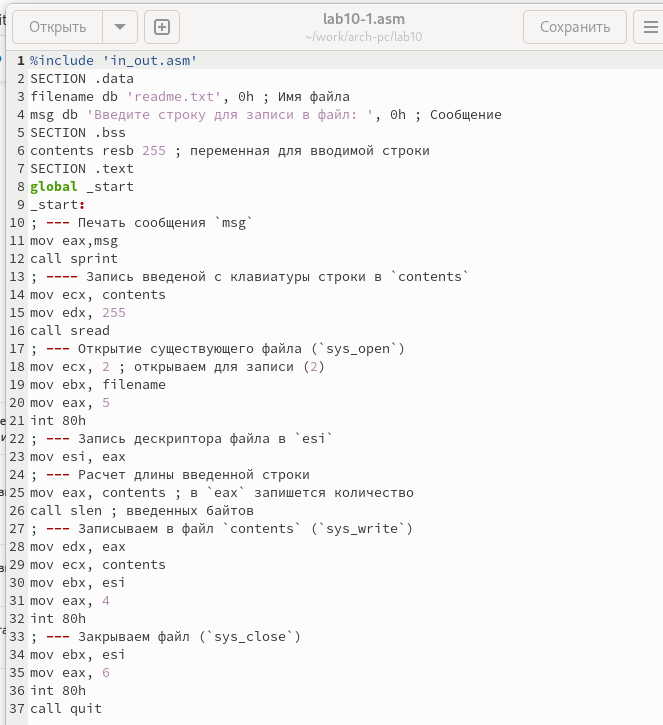
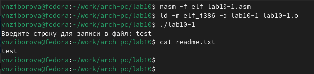
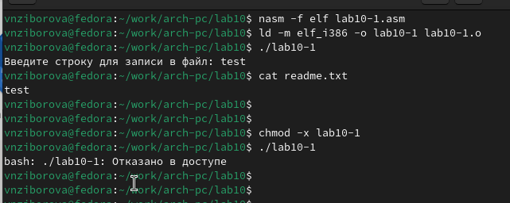
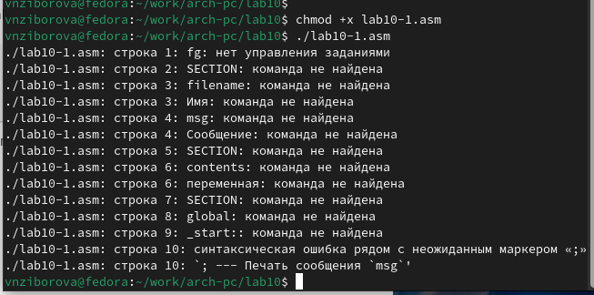
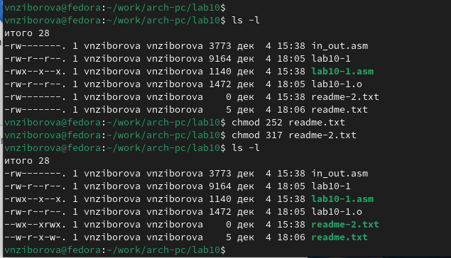
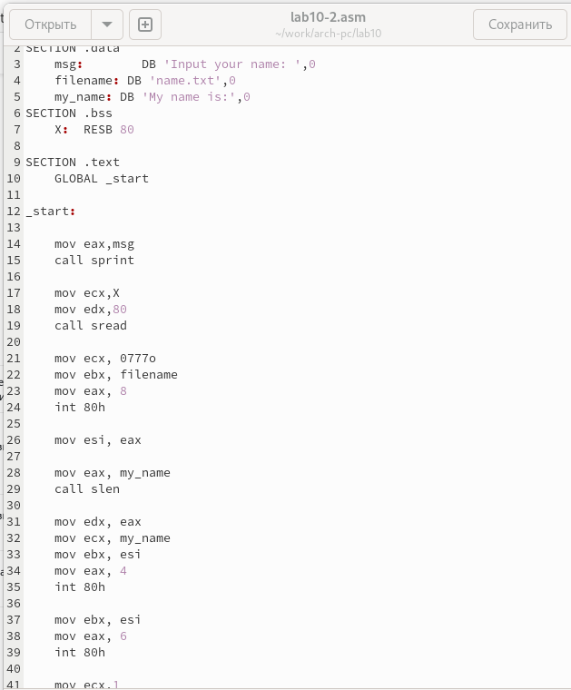
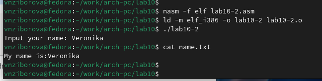

---
## Front matter
title: "Отчёт по лабораторной работе 10"
subtitle: "Работа с файлами средствами Nasm"
author: "Зиборова Вероника Николаевна НММбд-02-24"

## Generic otions
lang: ru-RU
toc-title: "Содержание"

## Bibliography
bibliography: bib/cite.bib
csl: pandoc/csl/gost-r-7-0-5-2008-numeric.csl

## Pdf output format
toc: true # Table of contents
toc-depth: 2
lof: true # List of figures
lot: true # List of tables
fontsize: 12pt
linestretch: 1.5
papersize: a4
documentclass: scrreprt
## I18n polyglossia
polyglossia-lang:
  name: russian
  options:
	- spelling=modern
	- babelshorthands=true
polyglossia-otherlangs:
  name: english
## I18n babel
babel-lang: russian
babel-otherlangs: english
## Fonts
mainfont: PT Serif
romanfont: PT Serif
sansfont: PT Sans
monofont: PT Mono
mainfontoptions: Ligatures=TeX
romanfontoptions: Ligatures=TeX
sansfontoptions: Ligatures=TeX,Scale=MatchLowercase
monofontoptions: Scale=MatchLowercase,Scale=0.9
## Biblatex
biblatex: true
biblio-style: "gost-numeric"
biblatexoptions:
  - parentracker=true
  - backend=biber
  - hyperref=auto
  - language=auto
  - autolang=other*
  - citestyle=gost-numeric
## Pandoc-crossref LaTeX customization
figureTitle: "Рис."
tableTitle: "Таблица"
listingTitle: "Листинг"
lofTitle: "Список иллюстраций"
lotTitle: "Список таблиц"
lolTitle: "Листинги"
## Misc options
indent: true
header-includes:
  - \usepackage{indentfirst}
  - \usepackage{float} # keep figures where there are in the text
  - \floatplacement{figure}{H} # keep figures where there are in the text
---

# Цель работы

Целью работы является приобретение навыков написания программ для работы с файлами.

# Выполнение лабораторной работы

Я создала каталог для программ лабораторной работы № 10, перешла в него и создала файлы `lab10-1.asm`, `readme-1.txt` и `readme-2.txt`.

В файл `lab10-1.asm` я записала текст программы из листинга 10.1 (Программа записи в файл сообщения). Затем создала исполняемый файл и проверила его работу.

{ #fig:001 width=70%, height=70% }

Программа запрашивает строку и перезаписывает её в файл `readme.txt`. Если файл не существует, строка не записывается.

{ #fig:002 width=70%, height=70% }

С помощью команды `chmod` я изменила права доступа к исполняемому файлу `lab10-1`, запретив его выполнение. Попыталась выполнить файл.

Файл не запускается, так как выполнение запрещено, атрибут "x" был снят во всех трех позициях.

{ #fig:003 width=70%, height=70% }

С помощью команды `chmod` я изменила права доступа к файлу `lab10-1.asm`, добавив права на выполнение. Попыталась снова выполнить его.

Файл запускается, и терминал пытается выполнить его содержимое как консольные команды. Однако инструкции ассемблера не являются командами терминала, поэтому возникли ошибки. Тем не менее, если в такой файл написать команды терминала, его можно будет выполнить.

{ #fig:004 width=70%, height=70% }

Предоставила права доступа к файлам `readme` в соответствии с вариантом из таблицы 10.4. Проверила правильность выполнения с помощью команды `ls -l`.

Для варианта 6: ```-w- r-x -w-``` и ```011 001 111```

{ #fig:005 width=70%, height=70% }

## Задание для самостоятельной работы

Написала программу, работающую по следующему алгоритму:

* Выводится приглашение: “Как Вас зовут?”
* Вводятся с клавиатуры фамилия и имя
* Создается файл с именем `name.txt`
* Записывается в файл сообщение “Меня зовут”
* Дописывается в файл строка, введенная с клавиатуры
* Файл закрывается

{ #fig:006 width=70%, height=70% }

{ #fig:007 width=70%, height=70% }

# Выводы

Я освоилa работу с файлами и правами доступа.

# Ответы на вопросы

1. **Каким образом в Unix-подобных ОС определяются права доступа к файлу?**

   В Unix-подобных операционных системах права доступа к файлу определяются с помощью трёх типов разрешений для трёх категорий пользователей. Эти разрешения включают:
   - **Чтение (r)**: разрешает читать содержимое файла.
   - **Запись (w)**: разрешает изменять содержимое файла.
   - **Исполнение (x)**: разрешает запускать файл как программу.

   Права доступа определяются для трёх категорий пользователей:
   - **Владелец (user)**: пользователь, который создал файл.
   - **Группа (group)**: группа пользователей, к которой принадлежит владелец.
   - **Остальные (others)**: все остальные пользователи.

2. **Как ОС определяет, является ли файл исполняемым? Как регулировать права на чтение и запись?**

   ОС определяет, что файл является исполняемым, по наличию права "x" (исполнение) для соответствующей категории пользователей. Это означает, что файл можно запустить как программу. 
   
   Для регулирования прав на чтение и запись используются команды `chmod`:
   - Для добавления права на чтение: `chmod +r <файл>`
   - Для добавления права на запись: `chmod +w <файл>`
   - Для добавления права на исполнение: `chmod +x <файл>`
   
   Уровни доступа могут быть настроены для владельца, группы и других пользователей.

3. **Как разграничить права доступа для различных категорий пользователей?**

   Права доступа для различных категорий пользователей разграничиваются с помощью команд `chmod`, где можно указать, какие права имеют владелец, группа и другие пользователи:
   - Владелец: `u` (user)
   - Группа: `g` (group)
   - Остальные пользователи: `o` (others)
   
   Например:
   - `chmod u+x <файл>` — добавляет право на исполнение для владельца.
   - `chmod g-w <файл>` — убирает право на запись для группы.
   - `chmod o=r <файл>` — даёт право на чтение только для остальных пользователей.

4. **Какой номер имеют системные вызовы sys_read, sys_write, sys_open, sys_close, sys_creat?**

   Номера системных вызовов в Linux (для x86) следующие:
   - **sys_read** — номер 0
   - **sys_write** — номер 1
   - **sys_open** — номер 5
   - **sys_close** — номер 6
   - **sys_creat** — номер 8

5. **Какие регистры и как используют системные вызовы sys_read, sys_write, sys_open, sys_close, sys_creat?**

   В Linux для архитектуры x86, регистры используются следующим образом:
   - **sys_read**:
     - `eax`: номер системного вызова (0)
     - `ebx`: дескриптор файла
     - `ecx`: указатель на буфер для чтения
     - `edx`: количество байт для чтения
   - **sys_write**:
     - `eax`: номер системного вызова (1)
     - `ebx`: дескриптор файла
     - `ecx`: указатель на данные для записи
     - `edx`: количество байт для записи
   - **sys_open**:
     - `eax`: номер системного вызова (5)
     - `ebx`: имя файла
     - `ecx`: флаги (например, O_RDONLY, O_WRONLY)
     - `edx`: режим доступа (например, 0666)
   - **sys_close**:
     - `eax`: номер системного вызова (6)
     - `ebx`: дескриптор файла
   - **sys_creat**:
     - `eax`: номер системного вызова (8)
     - `ebx`: имя файла
     - `ecx`: режим доступа

6. **Что такое дескриптор файла?**

   Дескриптор файла — это целое число, которое используется операционной системой для обозначения открытого файла в процессе. Это индекс в таблице открытых файлов, которая хранит информацию о каждом открытом файле. Дескриптор файла предоставляется при успешном открытии файла с помощью системных вызовов, таких как `open`, и используется для дальнейших операций с файлом (чтение, запись, закрытие и т.д.).
